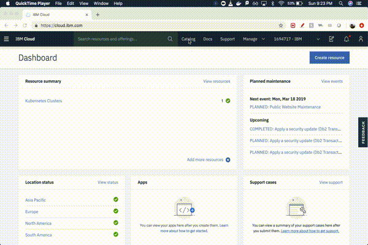
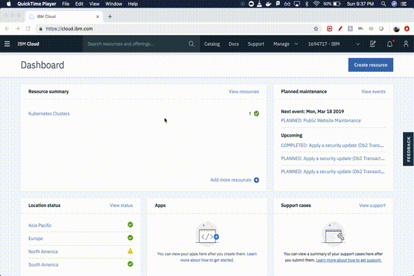
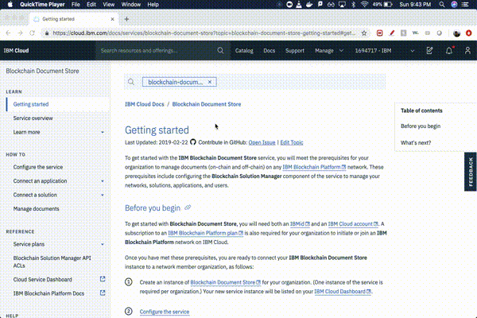
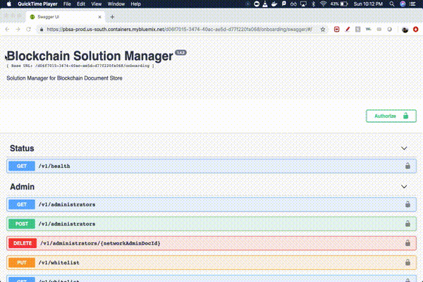
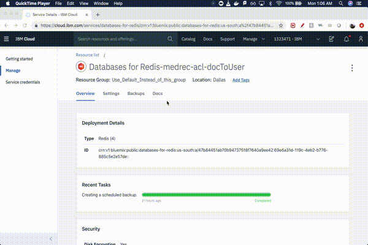
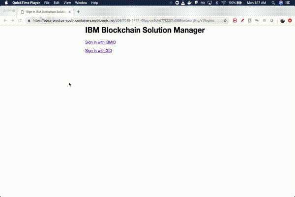
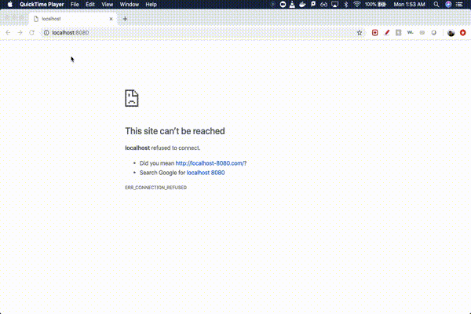

# Storing private healthcare data off-chain and medical data management using Blockchain 

Electronic Medical Records and Data craves the need for innovation. The way patient health records are stored and secured today do not showcase our technological advancement in this area in the past decade, and hospitals continue to use age-old data management systems for patient data. This is partly due to strict regulations around privacy and security of medical data, which has stifled the use of latest technology to make Medical data management more transparent and useful for both patients as well as doctors.

This code pattern showcases a medical data/access management platform built using blockchain. The application shows the platform from the point of view of 4 stakeholders -
* The Solution Admin is the admin of a conglomerate of hospitals, and has the highest of access levels in the hierarchy. They have the ability to onboard a new organization (hospital) to the conglomerate and assign/de-assign hospital admins on their dashboard.
* The Organization (hospital) Admin is the admin of a particular hospital which is part of the conglomerate/solution. They have the abiltity to onboard new users with the role of either Patient or Doctor, or remove a user.
* The Doctor is a user in the Organization with the appropriate role and has the ability to upload documents for their patients and download/view documents of their patients to which they have been granted access.
* The Patient is a user in the Organization with the appropriate role and has the ability to upload documents on their own, view them, view the document access logs and also manage access to their documents on their dashboard.

This code pattern is for developers who want to integrate with the Blockchain Solution Manager, Blockchain Document Store and the IBM Blockchain Platform. When you have completed it, you will understand how to:

* Connect the Blockchain Solution Manager and Blockchain Document Store with the IBM Blockchain Platform.
* Create a VueJS web app that has multiple dashboards on a Single Page Application, which can communicate in realtime with each other.
* Create a NodeJS server that is deployed to Kubernetes on IBM Cloud, and connected with a Redis database deployed on the IBM Cloud.
* Store and retrieve data from a Redis datastore for persitent storage through a NodeJS server.
* Make REST calls to an external service.
* Use JWT tokens for user management.

# Architecture flow


### Login flow
1. All the stakeholders of the application (Solution Admin, Hospital Admin, Doctor and Patient) begin the user flow by logging into their respective dashboards.
2. Clicking the login button leads to the login portal of the Blockchain Solution Manager, hosted on the IBM cloud.
3. The login portal uses OpenAPI Connect and allows the user the login through any onboarded IDP (in our example, we have onboarded IBMID ad GoogleID). Successful authentication leads to the JWT credentials for the user.

### Admin dashboard
4. The Solution Admin flow begins at the Admin Component, and requires the user to authenticate themselves through the Login Flow described above.
5. After successful authentication, the user can access the solution admin dashboard. They are able to view the solution, and add/remove hospitals from the solution using the Admin API's.
6. All the Admin API's connect with the Blockchain Solution Manager through REST to process the user queries.
7. The Blockchain Solution Manager connects with the IBM Blockchain Platform and updates the ledger appropriately.

### Organization dashboard
8. The Hospital Admin flow begins at the Organization Component, and requires the user to authenticate themselves through the Login Flow described above.
9. After successful authentication, the user can access the hospital admin dashboard. They are able to add/remove any user in their respective hospital with the onboarded roles (Patient/Doctor in our case) using the Organization API's.
10. All the Organization API's connect with the Blockchain Solution Manager through REST to process the user queries.
11. The Blockchain Solution Manager connects with the IBM Blockchain Platform and updates the ledger appropriately.

### Doctor dashboard
12. The Doctor flow begins at the Doctor Component, and requires the user to authenticate themselves through the Login Flow described above.
13. After successful authentication, the user can access the doctor dashboard. They are able to upload a medical record for a patient who is part of their hostpital and download any medical record associated with a patient to which they have access to, using the Doctor API's. The ACL's for all the patient documents is application level and is maintained through the Document ACL flow described below.
14. All the Doctor API's connect with the Blockchain Document Store through REST to process the user queries.
15. The Blockchain Document Store connects with the IBM Blockchain Platform and updates the ledger appropriately.

### Patient dashboard
16. The Patient flow begins at the Patient Component, and requires the user to authenticate themselves through the Login Flow described above.
17. After successful authentication, the user can access the patient dashboard. They are able to upload a medical record for themselves, download any of their medical records, view the access logs of their documents, and view/manage permissions to their documents, using the Patient API's. The ACL's for all the documents is application level and is maintained through the Document ACL flow described below.
18. All the Patient API's connect with the Blockchain Document Store through REST to process the user queries.
19. The Blockchain Document Store connects with the IBM Blockchain Platform and updates the ledger appropriately.

### Document access control list (ACL) flow
20. The Doctor and Patient Component are connected with the Redis API's that invoke methods to manage the document level access control across hospitals.
21. The Redis API's talk to a NodeJS server deployed in a Docker container in a Kubernetes cluster on the IBM Cloud.
22. The server talks to two Redis databases which hold the access-per-document and access-per-user permissions. 

# Included components

+ [IBM Blockchain Platform](https://console.bluemix.net/docs/services/blockchain/howto/ibp-v2-deploy-iks.html#ibp-v2-deploy-iks) gives you total control of your blockchain network with a user interface that can simplify and accelerate your journey to deploy and manage blockchain components on the IBM Cloud Kubernetes Service.
+ [IBM Blockchain Solution Manager:]() The Blockchain Document Store service includes the IBM Blockchain Solution Manager component, which enables organizations to easily manage blockchain networks, solutions, services, and users.
+ [IBM Blockchain Document Store]() is a comprehensive document management service for IBM Blockchain Platform business networks.
+ [IBM Cloud Kubernetes Service](https://www.ibm.com/cloud/container-service) creates a cluster of compute hosts and deploys highly available containers. A Kubernetes cluster lets you securely manage the resources that you need to quickly deploy, update, and scale applications.
+ [IBM Cloud Databases for Redis Service:](https://console.bluemix.net/catalog/services/databases-for-redis) Redis is an open source, in-memory data structure store, used as a database, cache and message broker. It supports data structures such as strings, hashes, lists, sets, sorted sets with range queries, bitmaps, hyperloglogs and geospatial indexes with radius queries.

## Featured technologies

* [Nodejs](https://www.nodejs.org/) is an open-source, cross-platform JavaScript run-time environment that executes JavaScript code server-side.
* [Vuejs](https://vuejs.org/) is a progressive framework for building user interfaces.
* [Redis](https://redis.io/) is an open source (BSD licensed), in-memory data structure store, used as a database, cache and message broker.
* [Bootstrap](https://getbootstrap.com/) is a free and open-source front-end Web framework. It contains HTML and CSS-based design templates for typography, forms, buttons, navigation and other interface components, as well as optional JavaScript extensions.
* [Docker](https://www.docker.com/) is a computer program that performs operating-system-level virtualization, also known as Containerization.

# Running the application

## Manually deploy to local machine
1. [Set up your machine](#1-set-up-your-machine)
2. [Create IBM cloud services](#2-create-ibm-cloud-services)
3. [Create a solution](#3-create-a-solution)
4. [Clone the repository](#4-clone-the-repository)
5. [Modify the configuration files](#5-modify-the-configuration-files)
6. [Run the application](#6-run-the-application)

### 1. Set up your machine

Install the following dependencies -

- [Docker](https://www.docker.com/): Go to the Docker website and download the installer. After installation, run Docker.
- [git](https://git-scm.com/): Install `git` which is a free and open source distributed version control system.

### 2. Create IBM cloud services

* Create the [IBM Cloud Kubernetes Service](https://cloud.ibm.com/catalog/infrastructure/containers-kubernetes).  You can find the service in the `Catalog`. For this code pattern, we can use the `Free` cluster, and give it a name.  Note, that the IBM Cloud allows one instance of a free cluster and expires after 30 days.

<br>
<p align="center">
  
</p>
<br>

* Create two instances of [Databases for Redis Service](https://cloud.ibm.com/catalog/services/databases-for-redis).  You can find the service in the `Catalog`.

<br>
<p align="center">
  
</p>
<br>

  > Note: You can use just one instance of Redis as well. Modify the code in the server repository to allow for this.

* Create the [IBM Blockchain Service](https://cloud.ibm.com/catalog/services/ibm-blockchain-5-prod). You can find the service in the `Catalog`.

<br>
<p align="center">
  
</p>
<br>

* Create the `Blockchain document store` and `Blockchain solution manager` services. These services are not currently available publicly on the `IBM cloud catalog`. You can reach out to `Rak-Joon Choi (rak-joon.choi@us.ibm.com)` to provision these services for you. Follow the service [documentation](https://cloud.ibm.com/docs/services/blockchain-document-store?topic=blockchain-document-store-getting-started#getting-started) to connect the `Blockchain document store` to the `Blockchain service`.

<br>
<p align="center">
  
</p>
<br>

### 3. Create a solution

* After configuring your services in the previous step, we now move on to creating a solution uisng our custom swagger url for the `blockchain solution manager` service. Go to the `Patch endpoint (/v1/solutions)` under `Solution` and authorize using the api by going to the `/v1/logins` url in a new tab, logging in as `Administrator`, and getting the JWT. Add the token prepended by `bearer` such that it looks like `bearer <JWT>`. After authorization, click on `try it out` to execute the api, and paste the following JSON in the `onboarding` section. Give the name `medrec_demo` to the solution.

```
{
  "onboardingdata": {
    "solution": {
      "id": "medrec_demo",
      "name": "demo for medrec pattern"
    },
    "roles": [
      {
        "id": "role_patient",
        "name": "Patient",
        "solutionId": "medrec_demo",
        "isBlockchainRole": true
      },
      {
        "id": "role_doctor",
        "name": "Doctor",
        "solutionId": "medrec_demo",
        "isBlockchainRole": true
      }
    ]
  }
}
```

<br>
<p align="center">
  
</p>
<br>

* After creating the solution successfully, add yourself as the admin of the solution. Go to the `Post endpoint (/v1/solutions/{solutionId}/administrators)` under `Solution` and authorize using the api by going to the `/v1/logins` url in a new tab, logging in as `Administrator`, and getting the JWT. Add the token prepended by `bearer` such that it looks like `bearer <JWT>`. After authorization, click on `try it out` to execute the api, and type your email id under `solutionAdministrators` in the JSON object. Provide `medrec_demo` as the `solutionId`.

<br>
<p align="center">
  
</p>
<br>

### 4. Clone the repository

```
git clone https://github.com/IBM/Medical-Blockchain.git
cd Medical-Blockchain
```

### 5. Modify the configuration files

* Modify the redis config file:
  - Go to the previously provisioned redis services on IBM Cloud.
  - Click on `Service credentials`.
  - Click on `New credential` button.
  - Once the new credentials are created, click on `view credentials`.
  - From the JSON object, extract the URI from `connection.rediss.composed[0]`.
  - From the JSON object, extract the certificate from `connection.rediss.certificate.certificate_base64`.
  - Navigate to the `server/config.json` file in the cloned repository.
  - Replace the URI and certificate values in the marked places.
  - Repeat the steps for the second provisioned service, and enter it in the second spot in the config file.

<br>
<p align="center">
  
</p>
<br>

* Modify the blockchain config file:
  - Go to the `/v1/logins` url for your blockchain document store service.
  - Login as administrator.
  - Extract the `iss` field from the decoded JWT and remove `/onboarding` string from it.
  - Navigate to the `src/secrets/config.json` file in the cloned repository.
  - Replace the `iss` field with the extracted value above.
  - Replace the `blockchain_channel` field with the name of the channel provided during connecting the blockchain service to the document store.

<br>
<p align="center">
  
</p>
<br>

### 6. Run the application

* Running the application locally:
  - To run the application on the local system, execute the `run-application.sh` file.
  - Go to `localhost:8080` to see the running application.

<br>
<p align="center">
  
</p>
<br>

* Running the application on kubernetes:
  - Navigate to server directory - `cd server`.
  - Build the docker image for the server - `docker build -t <DOCKERHUB_USERNAME>/medrec-server .`
  - Replace the image name in `manifest.yml`, where indicated.
  - Apply the manifest to the previously provisioned kubernetes cluster.
  - Navigate to `/src/apis/RedisApi.js` and replace the `baseURL` value with the Kubernetes load balancer IP.
  - Build and run the Vue application by executing the below in the repository home.
  - Go to `localhost:8080` to see the running application.

```
docker build -t medrec-vue .
docker run -d --restart always --name medrec-vue -p 8080:8080 medrec-vue
```

> Note: You can also deploy the Vue App to Kubernetes, by modifying the manifest.yml to support two pods.

# License

This code pattern is licensed under the Apache Software License, Version 2.  Separate third-party code objects invoked within this code pattern are licensed by their respective providers pursuant to their own separate licenses. Contributions are subject to the [Developer Certificate of Origin, Version 1.1 (DCO)](https://developercertificate.org/) and the [Apache Software License, Version 2](http://www.apache.org/licenses/LICENSE-2.0.txt).

[Apache Software License (ASL) FAQ](http://www.apache.org/foundation/license-faq.html#WhatDoesItMEAN)
